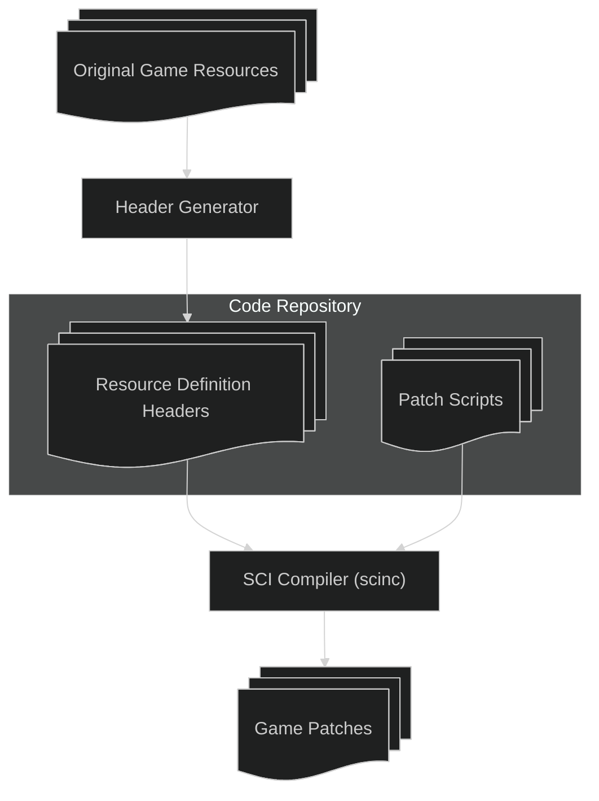

# Getting Started with `scinc`

`scinc` is released as a command-line tool, but it can be a bit complex to get it set up. The original use case of `scinc` was to be able to patch an existing game, which is what we'll explain in this document. It should be entirely possible to compile a brand-new game with it as well. If you would like to work on this, please contact us and we can work with you on it.

## Installing

`scinc` is released in compressed archives (`.zip`, `.tgz`) on the GitHub repo release page. Take a look at the recent releases, and download the package appropriate for your platform.

The archive contains a directory structure like so:

- `bin`
  - `scinc` (or `scinc.exe`)
- `include`
  - `sci_1_1`
    - `system.sh`
    - *other include files*
  - *other systems*

The `scinc` binary is the compiler itself, while the files in `include` are system header files for different target machines.

If you are not using the tool manually (for example, using the bazel build system), you will likely not have to download it directly.

## Making a Game Patch Project

In order to make a game patch, you will have to have the original game available, generate some files with it, set up a project with the replacement scripts, and build the patch resources. This section will step you through the process.

For visual reference, this diagram shows the flow of the process:

### Setup

{: .warning}
> The header generator is available in our github repo, but has not been set up for a proper release. The instructions below give more specific instructions that will be needed in the final version.

We'll need a few tools to get started. This guide will use our Bazel tooling to set up the project.

#### Install Bazel

Install Bazel from the website. As recommended, you may also install Bazelisk.

#### Extract the Template Project

Either download the source or use `git clone` to get a copy of the [GitHub repository](https://github.com/naerbnic/sci-patch-template).
